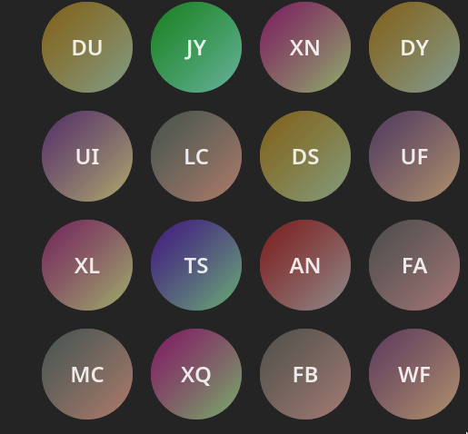

# Ava

short for avatar, ava is a **React** package that creates an avatar for a given string initial.


## Installation

via npm

```bash
npm install @karim-w/ava
```

via yarn

```bash
yarn add @karim-w/ava
```

## Usage

```ts
import { ava } from "@karim-w/ava";

function App() {
  //...
  return (
    <div>
      <Ava initials="KH" width="100px" height="100px" />;
    </div>
  );
}
```

## Props

| Name     | Type   | Default | Description                                  |
| -------- | ------ | ------- | -------------------------------------------- |
| initials | string |         | The initials to be used to create the avatar |
| width    | string |         | The width of the avatar                      |
| height   | string |         | The height of the avatar                     |
| textSize | string | 1.5rem  | The size of the text inside the avatar       |

## License

MIT

## Author

Karim Hassam

## Contributing

Pull requests are welcome. For major changes, please open an issue first to discuss what you would like to change.
